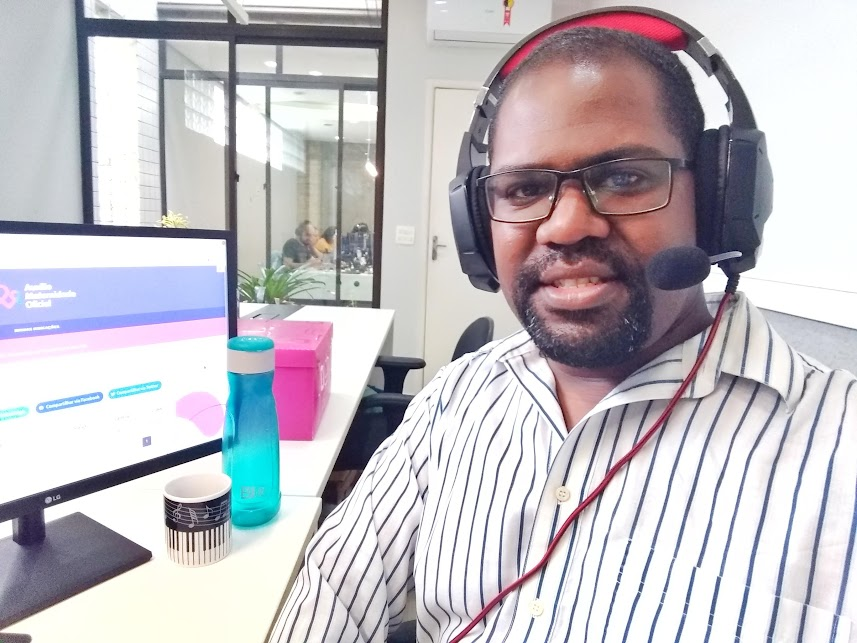

# Olá, eu sou Aguinaldo! :dart:

Sou **Engenheiro de Software Full-Stack** com mais de 3 anos de experiência em **plataformas financeiras escaláveis**. Tenho expertise em **Clojure/ClojureScript, Kafka e Cassandra**, entregando soluções end-to-end que otimizam investimentos e regras de negócio.  
Minha formação em **Análise e Desenvolvimento de Sistemas (Estácio)** e o **Bootcamp Full-Stack (Cubos Academy)** me proporcionam uma base sólida para enfrentar desafios complexos no mundo da tecnologia.

---

## 💻 O que você encontrará no meu GitHub

- **Projetos Full-Stack:** Features completas em fintechs, APIs RESTful robustas e aplicações web dinâmicas.  
- **Big Data & Infra:** Integrações com **Kafka** para eventos e **Cassandra** para dados em larga escala.  
- **Front-end Moderno:** Interfaces responsivas com **ClojureScript, Next.js, React, Vue e Angular**, sempre focando na experiência do usuário.  
- **Back-end Poderoso:** APIs seguras e eficientes em **Clojure, Node.js e SQL**, com pipelines de CI/CD otimizados.

---

## 🚀 Habilidades

- **Linguagens e Frameworks:** Clojure, ClojureScript, JavaScript, Next.js, Node.js, SQL, React, Vue, Angular, Python, Java, C#  
- **Big Data & Infra:** Kafka, Cassandra, Docker, WSL, Git/GitLab CI/CD  
- **Ferramentas:** VS Code, Postman, Jira, Trello, Swagger, JWT  
- **Idiomas:** Inglês Técnico

---

## 🔍 O que me motiva

- **Inovação e Criatividade:** Explorar novas tecnologias para criar soluções escaláveis e inteligentes.  
- **Colaboração e Crescimento:** Trabalho em equipe e troca de conhecimento como motor de evolução.  
- **Impacto Positivo:** Desenvolver sistemas que realmente fazem diferença em performance e valor para usuários e empresas.  

---

## 🌟 Projetos em Destaque

- **Fintech Micro-Exchange** – Features fintech Full-stack 100% em Clojure/ClojureScript – Kafka Streams + Cassandra + Re-frame + Tailwind
- **Carteira Digital Serverless (AWS)** – Fintech 100% serverless com Lambda, API Gateway, DynamoDB, SNS e SQS. Endpoints de depósito, saque e consulta de saldo, com alertas automáticos via SNS.
- **Fintech - API de Transações (Python + FastAPI)** – API RESTful de alta performance para depósitos e saques. Desenvolvida com FastAPI, SQLModel e SQLite, com tipagem estática, validação rigorosa de payloads, cálculo automático de saldo e documentação interativa (Swagger UI). Deploy simplificado via Docker.
- **Banco Digital (Next.js + SQLite)** – App full-stack com depósito, saque, saldo e histórico. Feito com Next.js, TypeScript, TailwindCSS e SQLite, unindo frontend e API em um único projeto.
- **API Cubos Bank** - Backend – Node.js + Express + PostgreSQL + Body-parser + CORS - API RESTful - Validação de dados + interações complexas entre recursos
- **Csharp .NET Bank (ASP.NET MVC + C#)** – Mini-fintech construída com ASP.NET Core MVC (.NET 10), C# e TailwindCSS via CDN. Interface moderna com fluxo completo de saldo, depósito e saque, arquitetura MVC organizada com camada de serviços e roteamento otimizado. Usando fundamentos sólidos do ecossistema .NET aplicado ao mundo financeiro.

---

🔗 **Vamos nos conectar!** Confira meus projetos, contribuições e colabore comigo em novas ideias.  

---

