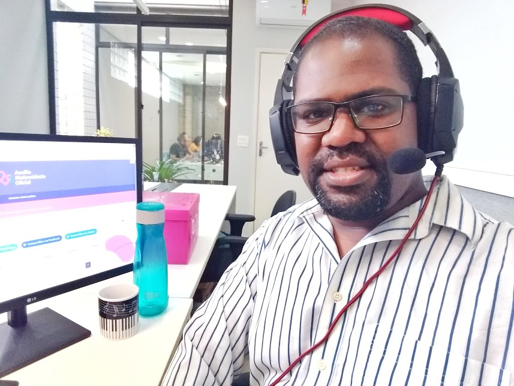

# Olá, eu sou Aguinaldo 👋

💻 Desenvolvedor Full-Stack | Integrações e Automação de Sistemas  
📍 São Paulo - SP  

---

## 🚀 Sobre mim

Sou desenvolvedor Full-Stack com experiência em **backend, integrações e automação de processos**, atuando na construção de soluções que conectam tecnologia a resultados reais de negócio.

Tenho trabalhado com **Node.js, Python, React e Next.js**, além de atuar com **integração de sistemas, APIs e automação de CRM (Zoho + SendPulse)**, ajudando empresas a organizarem seus dados, melhorarem seus processos e aumentarem sua eficiência operacional.

Minha base inclui também experiências com **arquitetura distribuída, mensageria (Kafka)** e aplicações escaláveis.

---

## 🎯 O que eu faço melhor

- 🔗 **Integração de sistemas e APIs**
- ⚙️ **Automação de processos e fluxos de dados**
- 🧠 **Backend robusto e escalável**
- 📈 **Soluções voltadas a negócio (CRM, leads, conversão)**
- 🌐 **Aplicações web modernas (React / Next.js)**

---

## 💻 Stack principal

### Backend
- Node.js (NestJS)
- Python (FastAPI)
- Java (Spring Boot - base)

### Frontend
- React.js
- Next.js
- TailwindCSS

### Integrações e Dados
- APIs REST
- Webhooks
- Zoho CRM
- SendPulse
- Kafka
- PostgreSQL, MySQL, MongoDB, Cassandra

### Infra & Ferramentas
- Docker
- AWS (Lambda, API Gateway, SQS, SNS)
- Git / CI-CD

---

## 🔥 Diferencial

👉 Não sou apenas desenvolvedor de código.

Trabalho conectando **tecnologia, processos e negócio**, com foco em:

- automação de vendas
- integração entre sistemas
- otimização de fluxo de dados
- redução de trabalho manual

---

## 🌟 Projetos em Destaque

### 💳 Fintech Micro-Exchange
Arquitetura distribuída com **Kafka + Cassandra + Clojure/ClojureScript**  
Sistema orientado a eventos com alta escalabilidade.

---

### ⚙️ API de Transações (Python + FastAPI)
API RESTful de alta performance com:
- validação robusta
- tipagem forte
- documentação automática (Swagger)

---

### 🏦 Banco Digital (Next.js)
Aplicação full-stack com:
- depósito, saque e histórico
- frontend + API integrados
- foco em performance e UX

---

### 🔗 Integrações CRM + Automação
Projetos conectando:
- Zoho CRM
- SendPulse
- APIs externas

Com foco em:
- automação de leads
- fluxo de vendas
- integração de dados

---

## 📈 Em evolução

Atualmente aprofundando:

- 🤖 IA aplicada (LLMs e automação)
- 🧠 Arquitetura de sistemas
- ⚡ Backend de alta performance
- 🔗 Integrações cada vez mais robustas

---

## 🤝 Vamos nos conectar

Se você trabalha com tecnologia, produto ou negócio, vamos trocar ideia.

